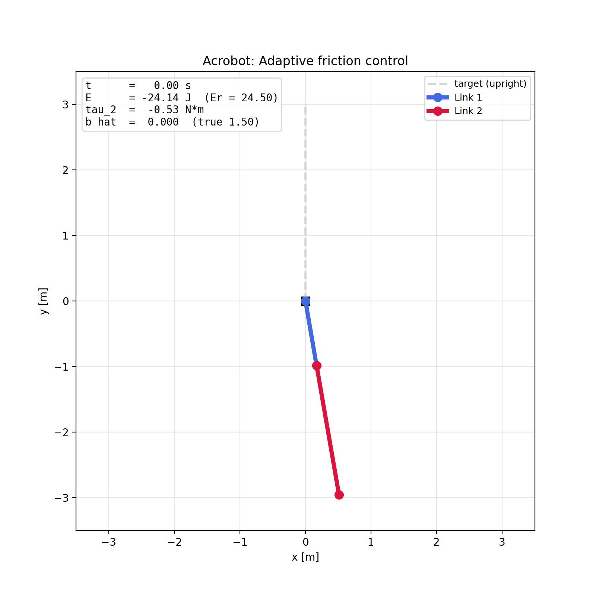
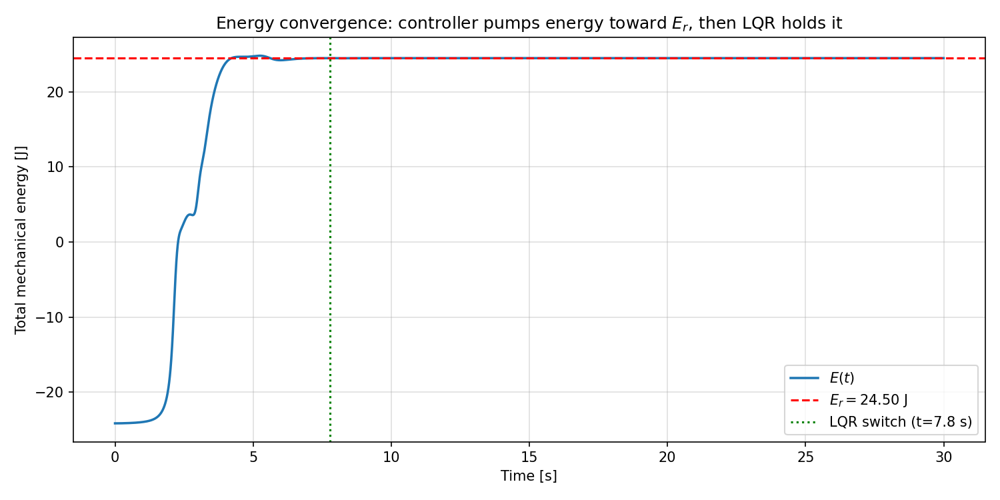
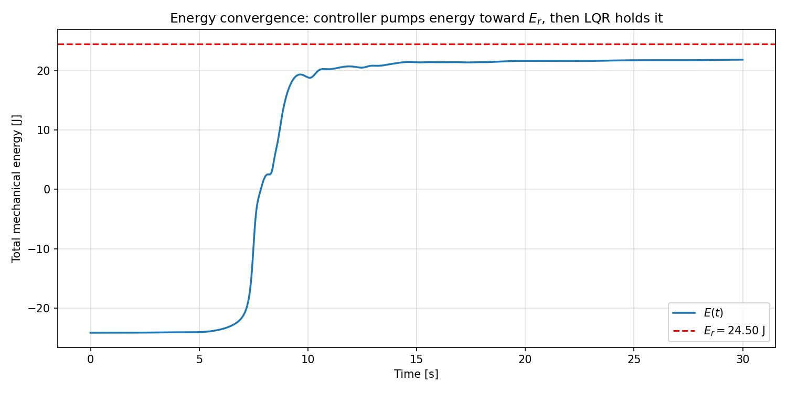
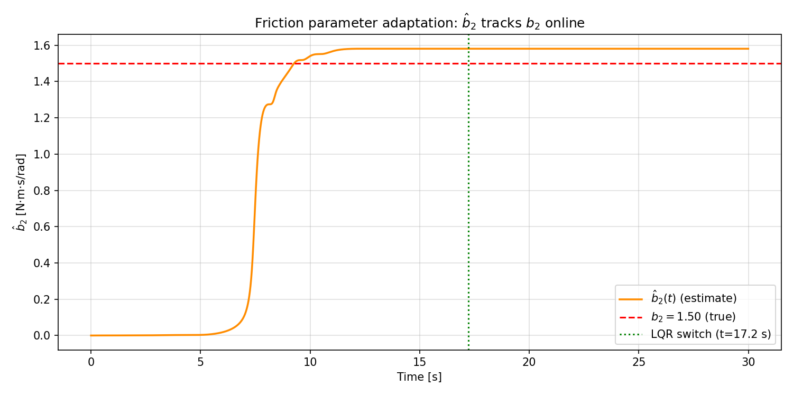
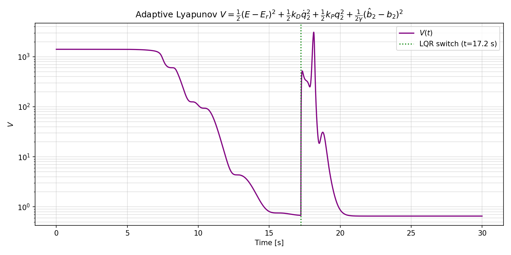
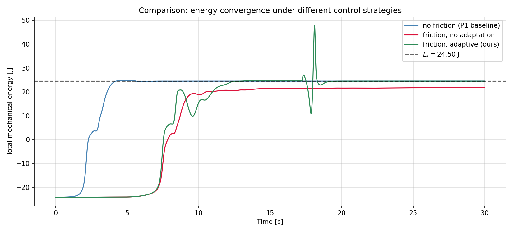
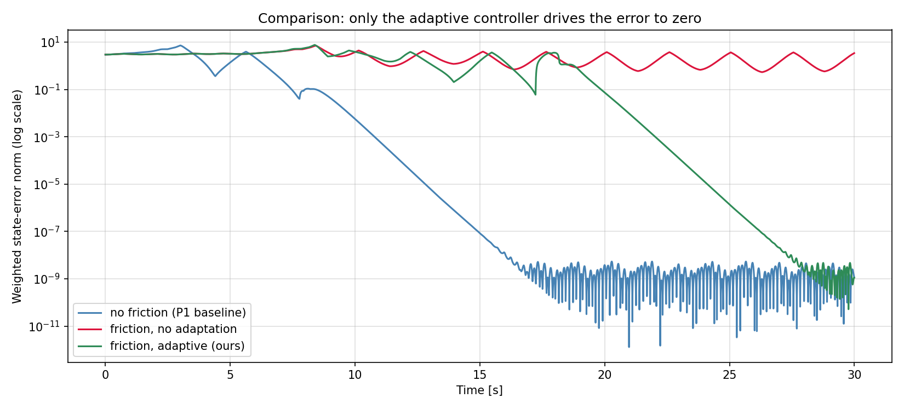

# Adaptive Friction Control of an Acrobot

<p align="center">
  
</p>

<p align="center"><i>Adaptive controller swings the acrobot up under unknown joint-2 friction and stabilises it with LQR, while estimating the friction coefficient online.</i></p>

---

## 1. Problem Definition

### Plant
A two-link planar acrobot (passive shoulder, actuated elbow) hangs from a fixed pivot. The elbow joint has **unknown viscous friction** with coefficient $b_2 > 0$ that resists the motion of joint 2 with a torque $b_2 \dot q_2$.

### Control objective
Drive the acrobot from the hanging-down equilibrium to the upright equilibrium $(q_1, q_2, \dot q_1, \dot q_2) = (\pi/2, 0, 0, 0)$ and stabilise it there, **without prior knowledge of $b_2$**.

### Class of methods
**Certainty-equivalence (CE) adaptive control.** The energy-shaping swing-up controller of Project 1 is augmented with a parameter-error term in the Lyapunov candidate; the resulting controller treats the running estimate $\hat b_2$ as the true friction and a gradient adaptation law drives $\hat b_2 \to b_2$ online.

### Assumptions
- Friction model: linear viscous (matched, single unknown scalar).
- Inertial parameters $\alpha_i, \beta_j$ are known (textbook values from Xin & Kaneda).
- No measurement noise; joint angles and rates are available.
- Plant is otherwise identical to the Project 1 model.

---

## 2. System Description

```
     fixed pivot
          |
        link 1   q_1 measured from horizontal,
        (passive  no actuator at the shoulder
         joint)
          |
       elbow ——— actuated, applies torque tau_2,
                  has unknown viscous friction b_2
          |
        link 2   q_2 relative to link 1
```

| Symbol | Meaning | Value |
| --- | --- | --- |
| $q_1$ | shoulder angle (link 1 vs horizontal) | rad |
| $q_2$ | elbow angle (link 2 vs link 1) | rad |
| $\dot q_1, \dot q_2$ | joint angular rates | rad/s |
| $\tau_2$ | elbow torque (control input) | N·m, $\|\tau_2\|\le 50$ |
| $b_2$ | unknown joint-2 viscous friction (true) | 1.5 N·m·s/rad |
| $\hat b_2$ | online estimate of $b_2$ | initial value 0 |
| $m_1=m_2$ | link masses | 1 kg |
| $l_1, l_2$ | link lengths | 1, 2 m |
| $l_{c1}, l_{c2}$ | distance pivot $\to$ centre of mass | 0.5, 1 m |
| $I_1, I_2$ | link inertias | 0.083, 0.33 kg·m² |
| $g$ | gravity | 9.8 m/s² |

State vector $x = [q_1, q_2, \dot q_1, \dot q_2]^\top \in \mathbb{R}^4$.

Equations of motion with friction:
$$M(q)\,\ddot q + C(q,\dot q)\,\dot q + G(q) + \begin{bmatrix} 0 \\ b_2 \dot q_2 \end{bmatrix} = \begin{bmatrix} 0 \\ \tau_2 \end{bmatrix}$$
with the standard Spong / Xin–Kaneda lumped-parameter forms of $M, C, G$. Only joint 2 is actuated; gravity, Coriolis and friction are entirely known structurally.

---

## 3. Method Description

### 3.1 Lyapunov candidate

Project 1 used the energy-shaping Lyapunov function
$$V_0 = \tfrac{1}{2}(E - E_r)^2 + \tfrac{1}{2} k_D \dot q_2^{\,2} + \tfrac{1}{2} k_P q_2^{\,2},$$
where $E$ is the total mechanical energy and $E_r = \beta_1 + \beta_2$ is its value at the upright equilibrium.

We extend it with a parameter-error term:
$$V \;=\; V_0 \;+\; \frac{1}{2\gamma}\,(\hat b_2 - b_2)^2 .$$
The extra term penalises mis-estimation of $b_2$ and lets us reason about state and parameter convergence within a single Lyapunov framework.

### 3.2 Certainty-equivalence control law

Treating $\hat b_2$ as if it were the true friction, the certainty-equivalence torque is
$$\boxed{\;\tau_2 \;=\; -\,\frac{(k_V \dot q_2 + k_P q_2)\,\Delta + k_D \bigl[M_{21}(H_1+G_1) - M_{11}(H_2+G_2 + \hat b_2 \dot q_2)\bigr]}{k_D M_{11} + (E - E_r)\,\Delta}\;}$$
where $\Delta = \det M(q_2)$. Setting $\hat b_2 \equiv 0$ recovers the Project 1 controller; setting $\hat b_2 \equiv b_2$ would give exact-friction compensation.

**Solvability.** The denominator is strictly positive provided $k_D > k_D^\star$ where
$$k_D^\star \;=\; \max_{q_2} \frac{(P_{\max}(q_2) + E_r)\,\Delta(q_2)}{M_{11}(q_2)} ,\qquad P_{\max}(q_2) = \sqrt{\beta_1^2 + \beta_2^2 + 2\beta_1\beta_2\cos q_2}.$$
For our parameters $k_D^\star \approx 35.74$. We pick $k_D = 35.8$.

### 3.3 Adaptation law

Choose
$$\dot{\hat b}_2 \;=\; -\,\gamma\,(E - E_r)\,\dot q_2^{\,2}, \qquad \gamma > 0.$$
Substituting the control law and the adaptation law into $\dot V$ cancels the parameter-error cross terms and yields
$$\dot V \;=\; -\,k_V \dot q_2^{\,2} \;\le\; 0 .$$
By LaSalle's invariance principle the trajectory converges to the largest invariant set on which $\dot q_2 = 0$. Generically that set contains only the upright equilibrium, and a small angular initial perturbation is enough to escape spurious co-dimension–one invariant sets where link 1 spins with link 2 aligned. Under persistence of excitation, $\hat b_2 \to b_2$.

### 3.4 LQR stabilisation

Once the state enters the basin of attraction of the upright equilibrium the swing-up controller hands over to a linear-quadratic regulator. The plant is linearised at upright **with the friction term included**, and the LQR gain $K$ is solved from the continuous-time algebraic Riccati equation. The friction-aware linearisation is essential: an LQR designed for the frictionless plant lacks the gain margin to catch the residual $\dot q_1$ at handover.

### 3.5 Hand-over criterion

Switch from adaptive swing-up to LQR when
$$|q_1 - \pi/2| + |q_2| + 0.1\,|\dot q_1| + 0.1\,|\dot q_2| < 0.06,$$
hysteretic (one-way). Once switched, the LQR holds the system at the upright; $\hat b_2$ is frozen at its hand-over value.

---

## 4. Algorithm Listing

```
ALGORITHM: Adaptive friction-aware swing-up + LQR
Inputs:    physical params (m, l, I, g),
           friction tuning (gamma, b_hat_0),
           control gains (kD, kP, kV, u_max, switch_threshold),
           initial state x0, simulation horizon t_final
Outputs:   trajectories t, q1, q2, dq1, dq2, u, E, V, b_hat
           and the LQR switch time t_sw

  1. PRECOMPUTE
       a. lumped parameters alpha_i, beta_i and E_r = beta1 + beta2
       b. solvability bound kD_star  (must satisfy kD > kD_star)
       c. linearise plant at upright with the friction term
          included; solve the continuous-time ARE for LQR gain K

  2. PHASE 1  --  ADAPTIVE SWING-UP
       Augment ODE state with b_hat.  At every integrator stage:
       a. compute torque tau_2 from the certainty-equivalence law
          using the current b_hat
       b. clip tau_2 to [-u_max, u_max]
       c. integrate plant dynamics (with true b_2) AND
          d(b_hat)/dt = -gamma * (E - E_r) * dq2^2 jointly
       d. terminate when |x_err|_w < switch_threshold (event)

  3. PHASE 2  --  LQR STABILISATION
       a. freeze b_hat at its phase-1 final value
       b. apply tau_2 = -K * (state - x_ref), clipped to u_max,
          until t_final

  4. POST-PROCESS
       a. evaluate V(t), E(t), tau_2(t) on the merged time grid
       b. produce per-scenario figures and the GIF animation
       c. produce comparison plots vs. (i) frictionless P1 baseline,
          (ii) friction with no adaptation
```

---

## 5. Experimental Setup

| Quantity | Symbol | Value |
| --- | --- | --- |
| True friction | $b_2$ | 1.5 N·m·s/rad |
| Initial estimate | $\hat b_2(0)$ | 0 |
| Adaptation gain | $\gamma$ | 0.005 |
| Energy-shape damping | $k_D$ | 35.8 |
| Energy-shape position | $k_P$ | 61.2 |
| Energy-shape velocity | $k_V$ | 66.3 |
| Torque limit | $u_\text{max}$ | 50 N·m |
| Switch threshold (friction) | $\varepsilon$ | 0.06 |
| LQR cost diag | $Q$ | (15, 15, 2, 2) |
| LQR cost input | $R$ | 1 |
| Initial state | $x_0$ | $(-1.4,\,0.001,\,0,\,0)$ |
| Simulation time | $t_f$ | 30 s |
| Integrator | RK45 | rtol = atol = $10^{-8}$, max step 5 ms |

The 0.001 rad initial offset on $q_2$ breaks the symmetry of a spurious LaSalle invariant set $\{q_2 = 0,\,\dot q_2 = 0\}$ in which link 1 spins with link 2 aligned; without the offset the trajectory grazes the upright but never enters the LQR basin.

---

## 6. Reproducibility

### Dependencies
```
numpy
scipy
matplotlib
```

### Running
```bash
pip install -r requirements.txt
python -m src.main           # all three scenarios + comparisons + GIFs
python -m src.main --no-anim # skip the GIFs (much faster)
python -m src.main --scenario friction_adaptive  # just the adaptive run
```

### Produced outputs

| Path | What |
| --- | --- |
| `figures/no_friction/` | P1 sanity-check plots (states, energy, V, control, error, phase) |
| `figures/friction_no_adapt/` | baseline failure plots (same set, minus parameter estimate) |
| `figures/friction_adaptive/` | adaptive-method plots, plus `friction_estimate.png` |
| `figures/comparison_energy.png` | $E(t)$ overlay across all three scenarios |
| `figures/comparison_error.png` | weighted-error overlay across all three scenarios |
| `animations/no_friction.gif` | frictionless baseline animation |
| `animations/friction_no_adapt.gif` | failure animation |
| `animations/friction_adaptive.gif` | main result animation |

---

## 7. Results Summary

### 7.1 No-friction baseline (Project 1)
The Project 1 controller on the frictionless plant reaches the upright at $t \approx 7.8$ s. Final state error is at machine epsilon. This run is included as a sanity check that nothing in the new code broke.

<p align="center">
  
</p>

### 7.2 Friction without adaptation (the problem)
With the same controller on the friction plant the swing-up **fails**: total energy plateaus around $E \approx 21.8$ J without ever reaching $E_r = 24.5$ J. Friction continuously bleeds energy that the controller does not know to compensate, so the trajectory cannot enter the LQR basin and the error never crosses the switching threshold.

<p align="center">
  
</p>

### 7.3 Friction with adaptation (our method)
The certainty-equivalence controller swings the acrobot up at $t \approx 17.2$ s and stabilises it with LQR. The friction estimate $\hat b_2$ converges from $0$ to $\approx 1.58$ within the first 12 s — just over a 5 % steady-state offset from the true $b_2 = 1.5$. Final state error is at machine epsilon.

<p align="center">
  
</p>

The adaptive Lyapunov function decreases by more than three orders of magnitude during the swing-up phase before a brief transient at the LQR hand-over:

<p align="center">
  
</p>

### 7.4 Side-by-side comparison

<p align="center">
  
</p>

<p align="center">
  
</p>

The energy plot makes the failure of the unadapted baseline visible at a glance: only the adaptive method (green) joins the no-friction reference (blue) at $E_r$. The error plot shows the same story on a log scale — only the two converging runs touch numerical zero.

### What works
- $V$ is monotone non-increasing during the swing-up phase (the spike at the LQR hand-over is the controller switching, not a Lyapunov-function violation).
- Friction parameter is estimated online without explicit excitation signals.
- The adaptive controller succeeds where the unadapted baseline fails — a clean comparison demonstrating the value of adaptation.
- LQR cleanly inherits the friction-aware linearisation and holds the upright through the rest of the simulation.

### Limitations
- The controller relies on a small initial offset in $q_2$ to avoid the symmetric spurious LaSalle invariant set; pure $q_2(0) = 0$ leaves the trajectory marginally trapped.
- Adaptation overshoots slightly ($\hat b_2 \approx 1.58$ vs $b_2 = 1.5$); persistence of excitation drops to zero once $\dot q_2 \to 0$ near the upright, which freezes the estimate before exact convergence.
- The certainty-equivalence guarantee is sensitive to $\gamma$. Outside a narrow band ($\sim 0.004$–$0.006$) the swing-up either adapts too slowly to keep up with the transient or overshoots into negative $\hat b_2$.
- No projection or $\sigma$-modification is used, so robustness to disturbances or unmodelled dynamics is not formally certified — those are natural follow-ups.

---

## 8. References

1. Xin, X., & Kaneda, M. (2007). *Analysis of the energy-based swing-up control of the Acrobot*. International Journal of Robust and Nonlinear Control, 17(16), 1503–1524.
2. Spong, M. W. (1995). *The Swing Up Control Problem for the Acrobot*. IEEE Control Systems Magazine, 15(1), 49–55.
3. Slotine, J.-J. E., & Li, W. (1991). *Applied Nonlinear Control*. Prentice Hall — chapters on Lyapunov stability and adaptive control.
4. Krstić, M., Kanellakopoulos, I., & Kokotović, P. V. (1995). *Nonlinear and Adaptive Control Design*. Wiley — for the certainty-equivalence framework and its Lyapunov-based analysis.
